# M-Fest Motorsport Website

## Project Description

M-Fest Motorsport website is a comprehensive platform for a car dealership, showcasing cars for sale with detailed information about each vehicle, weekly deals, and a contact form. It also features a financing form that integrates selected car info for customer convenience. An admin dashboard is available for website management, allowing for manual car entries or additions via VIN number. The website is designed with functionality in mind, including fully functional data tables for inventory, messaging, and financing. Features include searchable, sortable, and filterable data tables, a separate messaging section with new message indicators, pagination, and more.

## Used Technologies

- React
- Next.js 14+
- TypeScript
- JavaScript
- React TernStack
- react-hook-form
- zod
- shadcn
- Cloudinary
- TailwindCSS
- SWR
- Clerk

## Usage

The website features fully functional data tables for inventory, messaging, and financing. The dashboard allows the admin to add cars manually or by inputting the car's VIN number. It includes searchable, sortable, and filterable data tables, a separate messaging section with new message indicators and quantity, pagination, and more.

## License

Please choose an appropriate license for your project.

## Contact Information

- Email: tigranbalayan@me.com
- GitHub: [TigranBalayan10](https://github.com/TigranBalayan10)

## Acknowledgments

Special thanks to [TigranBalayan10](https://github.com/TigranBalayan10) for contributions to this project.

## Troubleshooting

For any bugs or issues, please report them to [TigranBalayan10](https://github.com/TigranBalayan10).

## Screenshots or GIFs

### Homepage screenshots
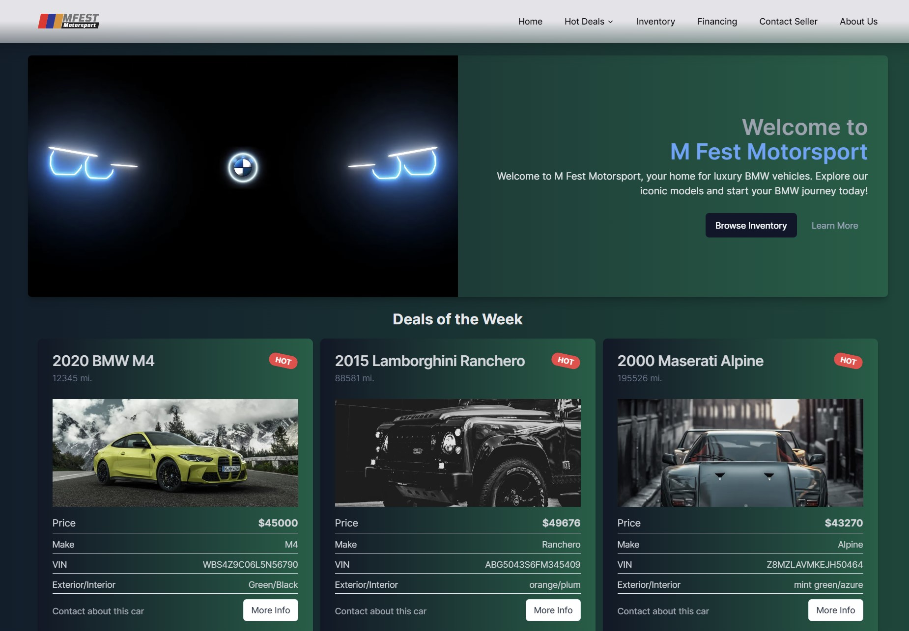
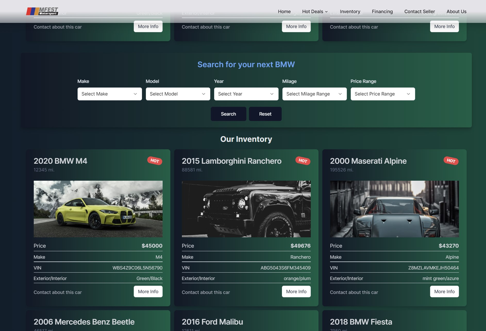

### Dashboard screenshots
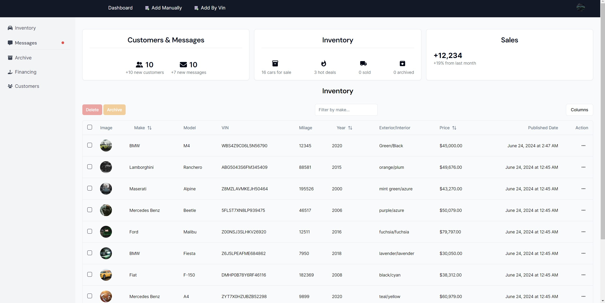
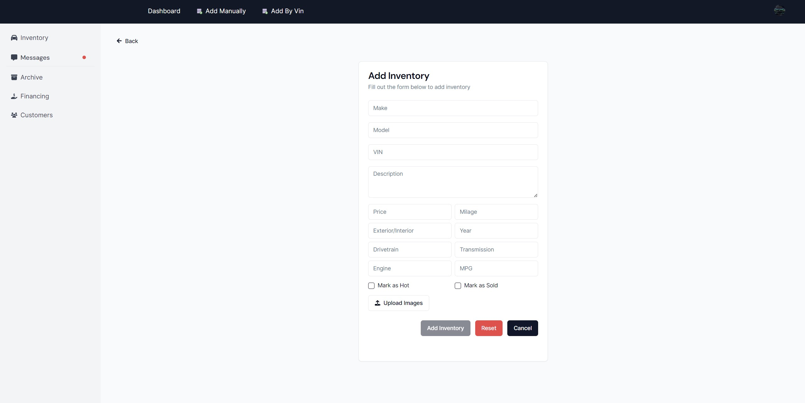
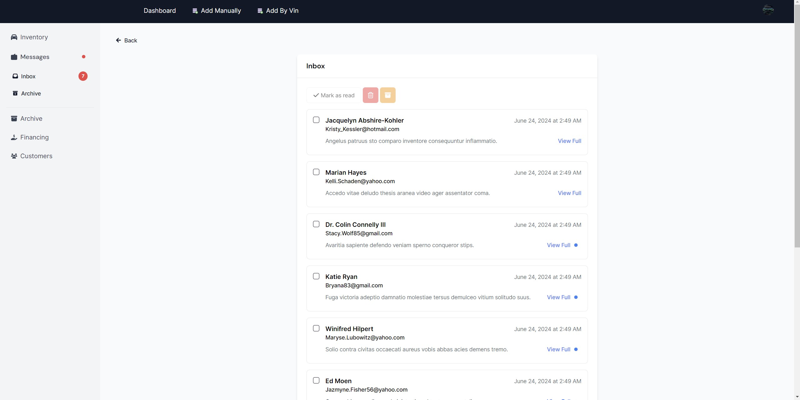

### HomePage Mobile View screenshots
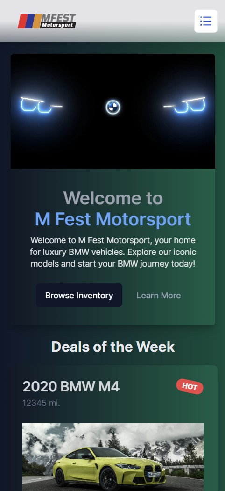
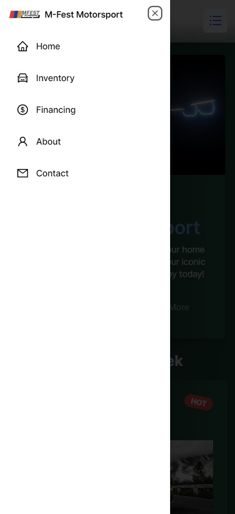
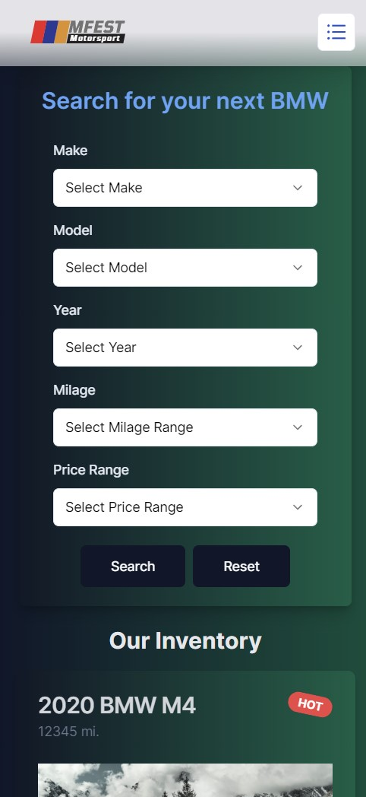

### Dashboard Mobile View screenshots

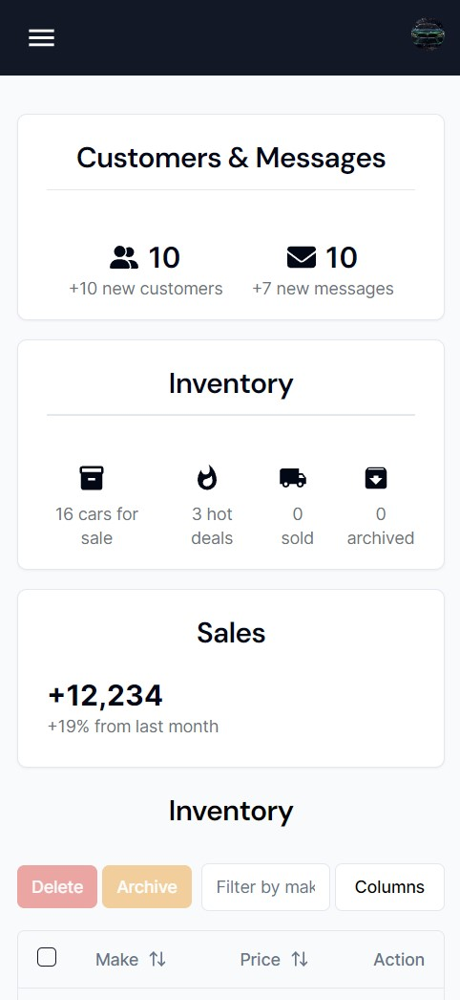
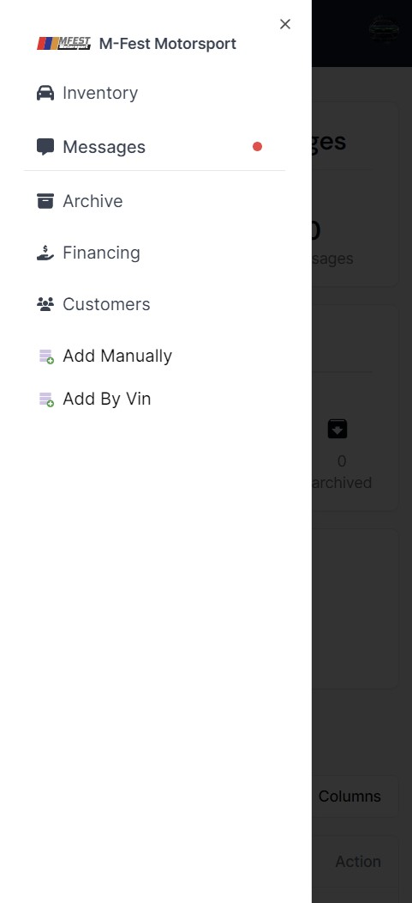
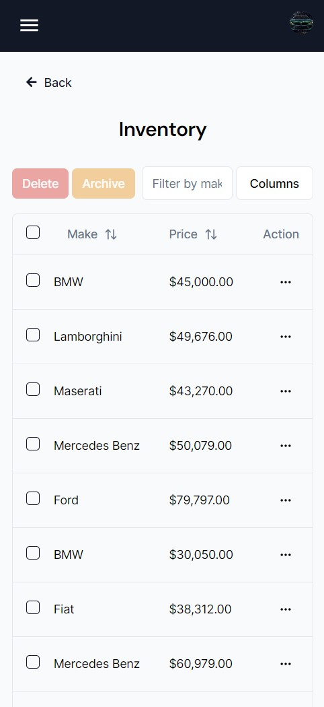

## Roadmap

Future updates will include more functionality in the dashboard for enhanced control over the website, as well as utilizing the dashboard as a dealership management tool.